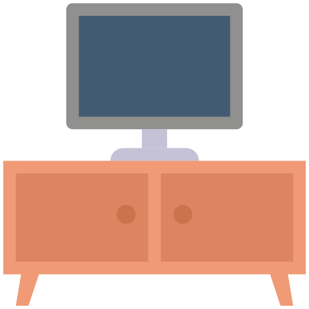
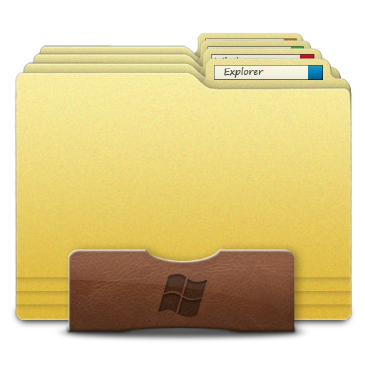

<?php
session_start(); // Asegúrate de que siempre se inicie la sesión al principio del archivo.
if (!isset($_SESSION['logueado']) || $_SESSION['logueado'] !== true) {
    header("Location: login.php"); // Redirige al login si no está logueado.
    exit();
}
?>
<!DOCTYPE html>
<html lang="es">
<head>
  <meta charset="UTF-8">
  <title>Menú Principal - Sistema DE Cable e Internet</title>

  <link rel="stylesheet" href="css/estilos.css">
  
</head>
<body>

  

    <ul class="principal-links">
      <li><a href="login.php">Cerrar sesión</a></li>
      <li><a href="menuprincipal.php">Menú principal</a></li>
    </ul>
  

  

    <h2>MENU CABLE E INTERNET</h2>
    <a href="https://davidlicona000.github.io/Registrar/">MENU REGISTROS</a>
    <a href="menuconsultar.php">MENU CONSULTAS</a>
    <a href="menueliminar.php">MENU ELIMINAR</a>
    <a href="menumodificar.php">MENU MODIFICAR</a>
    <a href="menuactualizar.php">MENU ACTUALIZAR</a>
    <a href="menureportes.php">MENU REPORTES</a>
    <a href="menulistados.php">MENU LISTADOS</a>
    <a href="login2.php">MENU CLIENTES</a>
  

  

    

      <h1>Bienvenido al Sistema de Cable e Internet</h1>
      
Selecciona una opcion del menu izquierdo para comenzar.
 
      <h5>Da click para una mini bienvenida...</h5>
    

    

      <h2>¡Bienvenido!</h2>
      
En F4UR INFINITY nos apasiona mantenerte siempre conectado. Ofrecemos servicios de televisión por cable e internet de alta velocidad, con planes diseñados para tu hogar o negocio.

Disfruta de contenido de calidad, conexión estable y atención personalizada, porque tu satisfacción es nuestra prioridad.

¡Conéctate con nosotros y descubre la mejor experiencia en entretenimiento y conectividad!.

    

    

      

        
        <h4>¿Qué es el servicio de cable?</h4>
      

      

        
        <h4>¿Qué es el servicio de internet?</h4>
      

      

        
        <h4>Da click para más información...</h4>
      

    

    

      <h2>Información</h2>
      
Selecciona una opcion para obtener más información.

    

  

  

    <a href="login.php" onclick="cerrarSesion()">Cerrar sesión</a>
  

  
</body>
</html>
